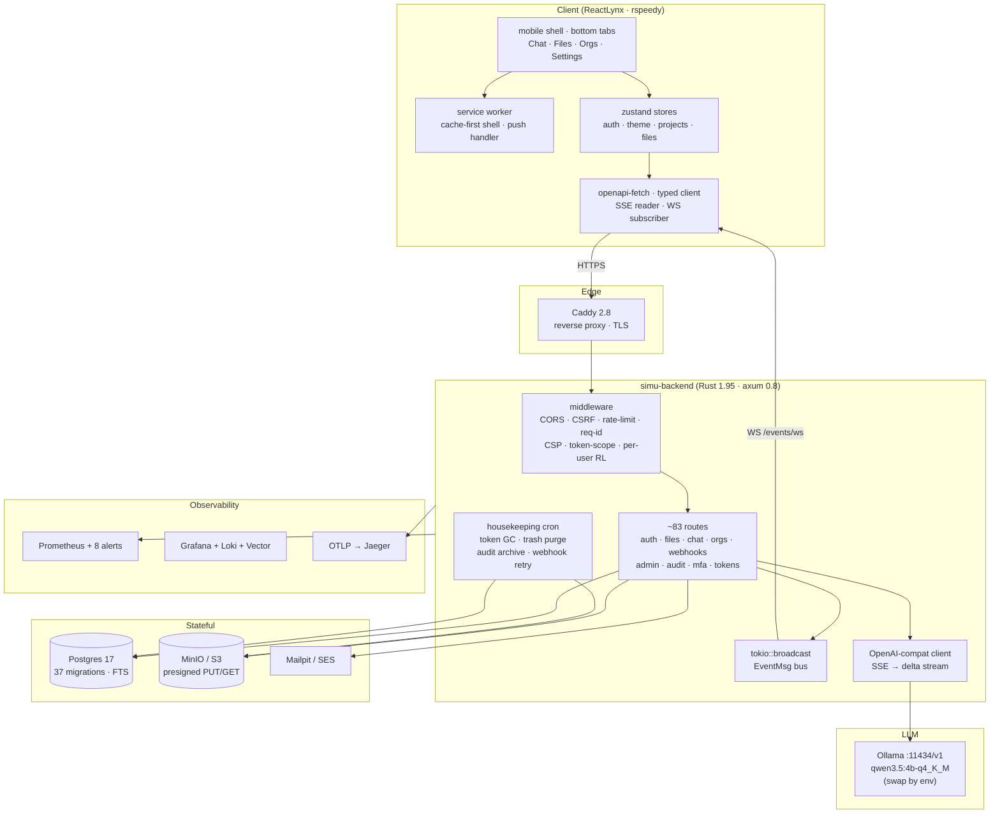

# simu — Lynx + Rust self-hosted SaaS spike

Mobile-first SaaS spike. Vertical phone-shape UI on web, native on iOS/Android. Real LLM chat over local Ollama. Every dep language-native, pinned exact, ≤6 months at audit time.

Repo: [github.com/1qh/simu-spike](https://github.com/1qh/simu-spike)

## Architecture



## Operational invariants (test-enforced)

- **Audit chain**: `sha256(prev_hash || canonical_json(row))`. `pg_advisory_xact_lock(4242424242)` serializes writes. Test fires 30 parallel records, verifies chain.
- **Soft-delete cascades**: file delete → revoke shares.
- **Quotas**: `USER_QUOTA_BYTES` + `ORG_QUOTA_BYTES` enforced on upload/version/move.
- **Admin MFA**: `totp_enabled` required (override via `REQUIRE_ADMIN_MFA=0`).
- **CSRF**: `simu_csrf` cookie ↔ `X-CSRF-Token` header double-submit.
- **CSP**: `default-src 'none'` on JSON; relaxed only on `/docs`.
- **Audit retention**: exports to S3 ndjson before purge; refuses purge if upload fails.

## Feature surface

| Domain | Capabilities |
|---|---|
| Auth | email+pw · password reset · email verify · TOTP MFA + recovery codes · OAuth (Google/GitHub auto-detect) · API tokens with scopes · session list/logout-all |
| Files | multipart + JSON-base64 upload · presigned PUT/GET · multipart upload · versions · shares (password) · tags · stars · comments · trash · bulk · zip · thumb · FTS · move · describe · integrity verify |
| Chat | SSE streaming via OpenAI-compat (Ollama default) · system_prompt + temperature · projects (client) · search · export md · share token (sha256-hashed) · rename/archive/delete · slash cmds · voice in (SpeechRecognition) · TTS · attach (img/text/file) · artifacts panel · live multi-device sync via bus · hand-rolled Lynx markdown |
| Orgs | create · members · invites (preview/accept) · per-org files · per-org stats |
| Admin | stats · users CRUD · role · lock · impersonate · backup · audit chain verify · CSV export |
| Webhooks | HMAC-SHA256 · retry+backoff · delivery log · enable/disable · test fire |
| PWA | manifest · SW cache-first shell · push event handler · permission UI |
| i18n | EN + VI via react-i18next |
| Realtime | `/events/ws` tokio broadcast bus (FileCreated, MessageCreated, …) |

## Tests

| Layer | Count | Tool |
|---|---|---|
| Rust property | 4 | proptest |
| Rust integration | many | testcontainers (pg + minio + mailpit) |
| Playwright E2E | 39 | shadow-DOM helpers |

## Quick start

```bash
# infra
cd infra && cp .env.example .env
docker compose up -d postgres minio mailpit
docker compose -f docker-compose.yml -f docker-compose.observability.yml up -d   # optional

# backend (terminal A)
cd backend && export $(grep -v '^#' .env | xargs) && cargo run

# frontend (terminal B)
cd frontend && bun install --frozen-lockfile && bun run dev

# LLM (terminal C, optional — chat falls back to stub if missing)
ollama serve && ollama pull qwen3.5:4b-q4_K_M
```

Ports → [`docs/PORTS.md`](docs/PORTS.md). Dev URLs: Caddy `:8444`, backend `:8088`, Grafana `:3100` (`admin` / `simu_dev_grafana`), Mailpit `:8125`, MinIO `:9101` (`simuadmin` / `simu_dev_minio`).

## Justfile

```bash
just infra-up          # postgres+minio+mailpit+nats
just obs-up            # + Prom+Grafana+Loki+Vector+Valkey
just backend-dev       # cargo watch -x run
just frontend-dev      # rspeedy dev
just backend-test      # nextest
just e2e               # openapi codegen + playwright
just audit             # cargo-audit + cargo-deny
just trivy · just sbom · just ci
```

## Docs index

- [`docs/PORTS.md`](docs/PORTS.md) — host port map
- [`docs/DEP_AUDIT.md`](docs/DEP_AUDIT.md) — pinned versions + freshness rule
- [`docs/SPIKE_PLAN.md`](docs/SPIKE_PLAN.md) — shipped vs deferred + roadmap
- [`docs/TESTING.md`](docs/TESTING.md) — test layers, running locally, CI
- [`docs/WEBHOOKS.md`](docs/WEBHOOKS.md) — receiver verification
- [`docs/DISASTER_RECOVERY.md`](docs/DISASTER_RECOVERY.md) — RPO/RTO + playbooks
- [`CONTRIBUTING.md`](CONTRIBUTING.md) — commits, deps, branching
- [`frontend/README.md`](frontend/README.md) — Lynx app stack + panels
- [`frontend/AGENTS.md`](frontend/AGENTS.md) — agent patterns for the Lynx side

## Non-stackable externals

Apple Dev ($99/yr) · Google Play ($25) · payment processor · deliverable SMTP · APNs/FCM push.
