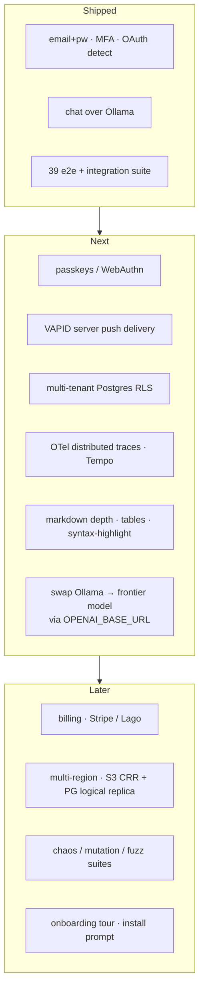

# Spike Plan — shipped vs deferred

The 160-checkpoint spike plan is fulfilled. This is the post-spike status. For feature surface, see [README.md](../README.md). For test status, see [TESTING.md](TESTING.md).

## Pillars

```mermaid
graph LR
  Glue[Glue & core ✅] --> Type[Type-safety ✅]
  Type --> Sec[Security ✅]
  Sec --> Auth[Auth & tenancy ✅]
  Auth --> Res[Resilience ⚠️]
  Res --> Perf[Performance ✅]
  Perf --> Corr[Correctness ✅]
  Corr --> Obs[Observability ✅]
  Obs --> DX[DX ✅]
  DX --> Build[Build & deploy ✅]
  Build --> Multi[Multi-platform ⚠️]
```

## Beyond original plan (autonomous push)

- WebSocket event bus (`/events/ws`, tokio broadcast) · password reset · MFA + recovery · OAuth · API tokens with scopes
- Webhooks (HMAC + retry + delivery log) · file versions · shares · tags · stars · comments · trash · FTS · presigned PUT/GET
- Orgs (members, invites, per-org files/stats) · admin (CRUD, lock, impersonate, backup, audit verify, CSV)
- PWA (manifest + SW cache + push handler) · i18n EN+VI · Tailwind preset
- **Chat application layer**: SSE streaming via OpenAI-compat (Ollama default), system_prompt + temperature, projects (client), search, export md, share token, slash cmds, voice in, TTS, attach (img/text/file), artifacts, live multi-device sync, hand-rolled Lynx markdown
- Self-hosted CI: Forgejo + runner · k6 + Lighthouse infra
- LynxExplorer iOS 3.7 + Android 3.7 installed and verified

## Roadmap (post-spike)

## Known tradeoffs

| Decision | Reason |
|---|---|
| `PrivateCookieJar` over `tower-sessions-sqlx-store` | upstream stale; stateless removes drift |
| `utoipa + openapi-typescript` over `rspc` | rspc stale; OpenAPI = SDK-friendly |
| JSON+base64 upload over multipart | Lynx lacks `FormData` / `Blob` |
| `sea-orm` over `diesel-async` | diesel-async stale |
| Chat against local Ollama | hot-swap to frontier by env var; spike has zero secrets in repo |
| Hand-rolled `lynxMarkdown.tsx` | Lynx engine rejects Unicode-class regex (kills `react-markdown`) |
| Service worker push (no VAPID delivery yet) | client handler ready; server delivery requires VAPID keypair + `web-push` crate + `push_subscriptions` table |

## Unavoidable externals

Apple Dev $99/yr · Google Play $25 · payment processor · SMS deliverability · APNs/FCM (no self-host).
