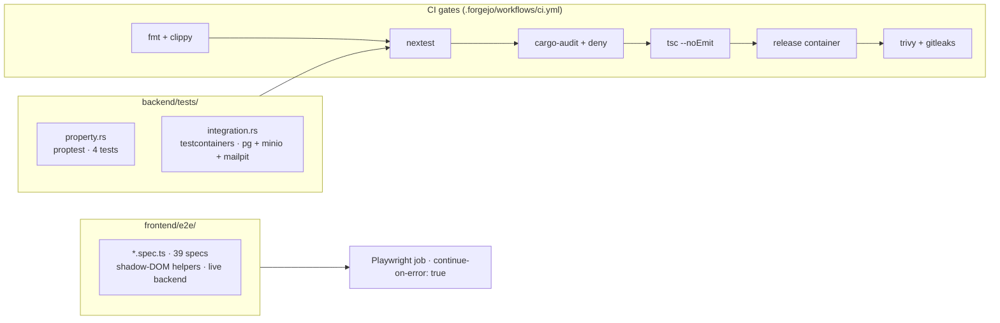

# Testing

## Layers



## Run locally

```bash
# infra
docker compose -f infra/docker-compose.yml up -d postgres minio nats mailpit
docker exec simu-minio mkdir -p /data/simu-uploads

# backend (e2e-friendly limits)
cd backend
RATE_LIMIT_RPS=10000 RATE_LIMIT_BURST=10000 PER_USER_RPS=10000 \
  REQUIRE_ADMIN_MFA=0 BIND_ADDR=0.0.0.0:8088 \
  env $(cat .env | xargs) ./target/release/simu-backend

# frontend dev server
cd frontend && bun run dev

# tests
cd frontend && bunx playwright test          # all 39
cd backend && cargo nextest run              # property + integration
```

## Known flakes

| Spec | Issue | Mitigation |
|---|---|---|
| `per-user-rl.spec` | spawns own backend on `:8089` with hard-coded `/Users/o/simu/backend/.env` | dev box only |
| `ws.spec` | `BrowserContext.addCookies` doesn't carry `simu_session` reliably to `WebSocket` ctor | covered by `ws_receives_file_created_broadcast` in `tests/integration.rs` |

CI marks the Playwright job `continue-on-error: true`. Required gates: fmt, clippy, nextest, tsc, build, trivy, gitleaks.

## Adding a test

- New endpoint → ≥1 E2E in `frontend/e2e/`
- New invariant → property test in `backend/tests/property.rs`
- Bug fix → regression test alongside the fix (same commit)
