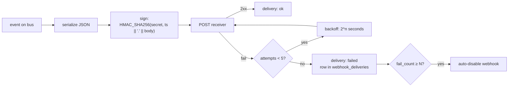

# Webhooks — receiver verification

Outbound webhooks carry HMAC-SHA256 in `x-simu-signature`. Verify before trusting the body.

## Headers

| Header | Value |
|---|---|
| `x-simu-signature` | `sha256=<hex digest>` over `{timestamp}.{raw_body}` |
| `x-simu-timestamp` | unix seconds — reject if skew > 300s |
| `x-simu-event` | `file_created` · `file_deleted` · … |
| `x-simu-delivery` | uuid v7 (sortable) — idempotency key |

## Dispatch lifecycle



Delivery log lives in `webhook_deliveries` (migration `m20260424_000019`). Query via `GET /api/webhooks/{id}/deliveries`.

## Reference verifier (Node)

```ts
import crypto from 'node:crypto'

function verify(headers: Record<string, string>, secret: string, rawBody: Buffer): boolean {
  const sig = headers['x-simu-signature']
  const ts = headers['x-simu-timestamp']
  if (!sig?.startsWith('sha256=') || !ts) return false
  if (Math.abs(Date.now() / 1000 - Number(ts)) > 300) return false

  const expected = crypto.createHmac('sha256', secret)
    .update(`${ts}.${rawBody.toString('utf8')}`)
    .digest('hex')

  const a = Buffer.from(sig.slice(7), 'hex')
  const b = Buffer.from(expected, 'hex')
  return a.length === b.length && crypto.timingSafeEqual(a, b)
}
```

Python and Rust receivers follow the same shape: strip `sha256=`, check timestamp skew, recompute HMAC over `${ts}.${body}`, constant-time compare.

## Idempotency

Key on `x-simu-delivery`. Retries reuse the delivery uuid — your handler sees the same id.

## Rotation

`POST /api/webhooks/{id}/rotate` — coming soon. Until then: delete + recreate to invalidate the old secret.
